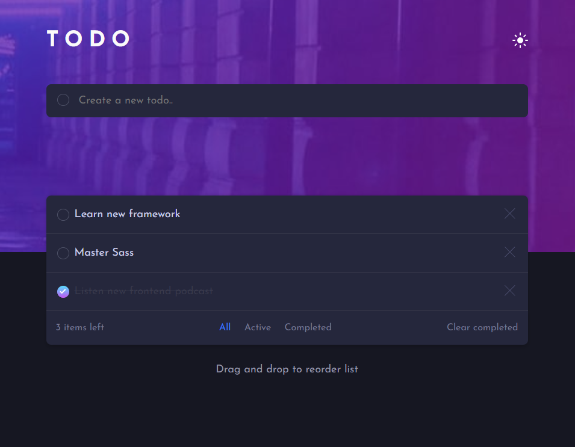

# Frontend Mentor - Todo app solution

This is a solution to the [Todo app challenge on Frontend Mentor](https://www.frontendmentor.io/challenges/todo-app-Su1_KokOW). Frontend Mentor challenges help you improve your coding skills by building realistic projects.

## Table of contents

- [Overview](#overview)
    - [The challenge](#the-challenge)
    - [Screenshot](#screenshot)
    - [Links](#links)
- [My process](#my-process)
    - [Built with](#built-with)
    - [What I learned](#what-i-learned)
    - [Continued development](#continued-development)
    - [Useful resources](#useful-resources)
- [Author](#author)

**Note: Delete this note and update the table of contents based on what sections you keep.**

## Overview

### The challenge

Users should be able to:

- View the optimal layout for the app depending on their device's screen size
- See hover states for all interactive elements on the page
- Add new todos to the list
- Mark todos as complete
- Delete todos from the list
- Filter by all/active/complete todos
- Clear all completed todos
- Toggle light and dark mode
- **Bonus**: Drag and drop to reorder items on the list

### Screenshot



### Links

- Repository URL [here](https://github.com/SquirrelloDev/todo-app-next)
- Live Site URL [here](https://todo-app-next-1qwo9a2hx-squirrello-maker.vercel.app/)

## My process

### Built with

- Semantic HTML5 markup
- Mobile-first workflow
- TypeScript
- [React](https://reactjs.org/) - JS library
- [Next.js](https://nextjs.org/) - React framework
- [Css modules](https://github.com/css-modules/css-modules) - For styles
- [MongoDB Atlas](https://www.mongodb.com/atlas/database) - As a cloud database
- [React beatiful dnd](https://github.com/atlassian/react-beautiful-dnd) - For the drag and drop feature
- [React hot toast](https://react-hot-toast.com/) - Simple library to make a toasts faster

### What I learned

This project helped me to understand how beneficial the TypeScript is. I saw the benefits while the built-in Next linter was throwing multiple errors (especially in places where i forgot to set the type 😅).

I've also learned that the documentation is your best friend when it comes to typing all the custom variables from various dependencies.
For example the **result** parameter from react beatiful dnd has a specific architecture, but the documentation hasn't a one concrete type, so I'd to type on my own using at least some useful parts.
```ts
export type DragEndResult = {
    draggableId: string,
    type: string,
    reason: string,
    source: {
        droppableId: string,
        index: number
    },
    destination: DraggableLocation | null | undefined
}
```
Moreover, I'm now more used to **Static Site Generation mechanism** in the Next.js and how **API routes** work

### Continued development

My next step is to work a little more with Next and use more of its potential, and I'm think that the API countries will be a great playground for that.

### Useful resources

- [Egghead.io react-beatiful-dnd course](https://egghead.io/courses/beautiful-and-accessible-drag-and-drop-with-react-beautiful-dnd) - Great place to get started with this drag and drop library (even if it is written in class components)

## Author

- Frontend Mentor - [@SquirrelloDev](https://www.frontendmentor.io/profile/SquirrelloDev) - more of my projects from this platform
